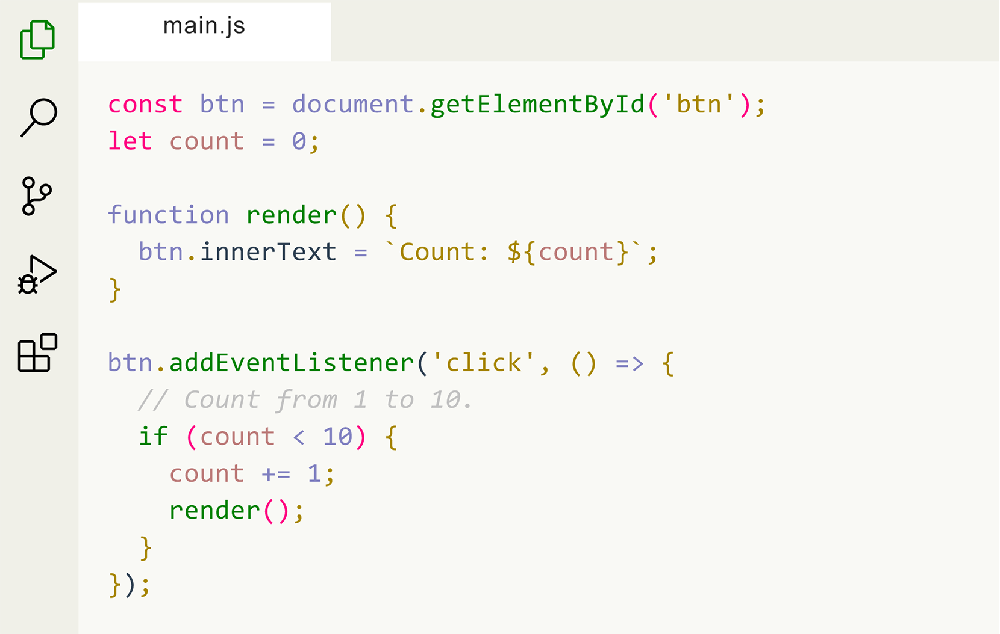

### Install using VSCode [Marketplace](https://marketplace.visualstudio.com/items?itemName=Yojeero.cream)

1. Enter VSCode [Marketplace](https://marketplace.visualstudio.com/items?itemName=YYojeero.cream)
2. Search for `Cream`

You can easily install the **Alpen Theme** by using the **Command Palette**:

1. Go to View -> `Command Palette`
2. Enter `Install Extension`
3. Write `Cream`
4. Select it or press Enter to install

### Activating the Cream Theme

1. Click the `gear button` in the lower left corner.
2. Click `Color Theme`.
3. Select **Cream** in the list.
